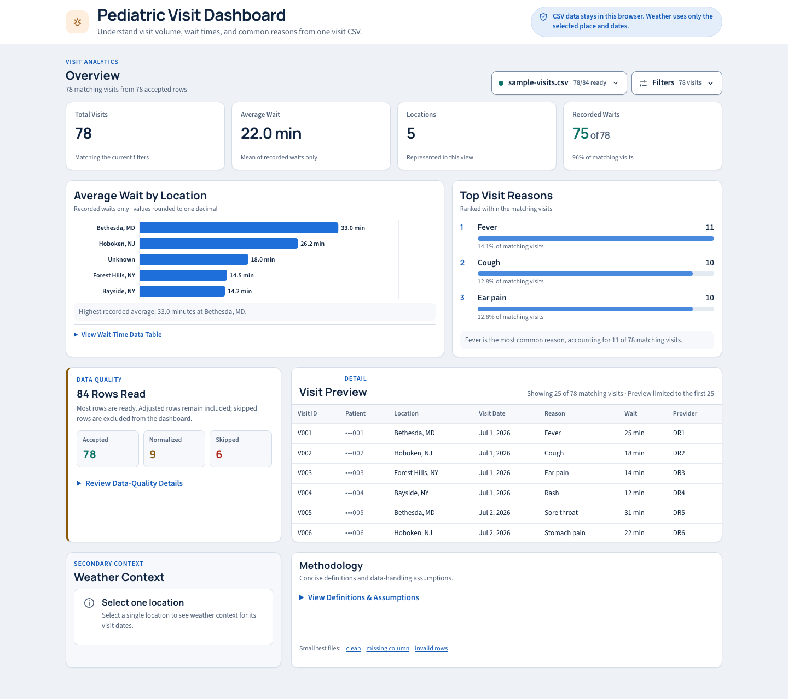

# Pediatric Visit Dashboard

A browser-only React application that turns a pediatric visit CSV into a compact, one-page review of volume, wait times, locations, data coverage, and common visit reasons. Filters recalculate every metric and chart, a data-quality summary explains skipped or adjusted rows, and an optional weather card adds daily context for one selected location. CSV rows and identifiers stay in the browser; the only dashboard-derived values sent out are a policy-approved place name, coordinates, and a date range for weather. The page separately requests Google Fonts, which exposes ordinary request metadata but no dashboard data.

This is a take-home exercise, not a production system. See "Known limitations" and "What I would improve for production" before relying on it for anything real.



## Features

Implemented and tested:

- A responsive product interface with a compact overview, accessible controls, explicit empty states, and no raw parser output
- Drag-and-drop or browse upload, one-click demo data, and downloadable sample files
- CSV parsing with explicit, documented rules for every kind of bad or missing value
- Whole-file rejection with an actionable message when the file is empty, has no data rows, or is missing required columns
- A warning summary, one line per problem category, with capped row examples instead of hundreds of individual messages
- Pure filter functions: inclusive date range, single location, minimum wait time
- Pure KPI functions: total visits, overall and location wait averages, distinct locations, wait coverage, and top three reasons with a deterministic tie-break
- A horizontal wait-time chart with a data-table alternative, a ranked reasons chart, and a 25-row visit preview with masked patient identifiers
- Weather context from Open-Meteo for one selected, policy-approved U.S. location and the visible date range, with cancellation, caching, and explicit states
- 146 unit tests on the data and weather logic, run in Node with no browser simulation

## Technical stack

| Layer | Choice | Why |
|---|---|---|
| UI | React 19 with TypeScript 6 | Required by the exercise; TypeScript makes "a wait can be null" a compiler-checked fact |
| Build and dev server | Vite 8 | `npm run dev` with hot reload and zero configuration for CSS Modules |
| CSV parsing | Papa Parse 5 | Correct handling of quoted commas, embedded newlines, byte order marks, and delimiter detection |
| Charts | Recharts 3 | Renders the responsive horizontal wait chart and its accessible chart layer |
| Tests | Vitest 5 | Shares the Vite configuration, so tests run TypeScript with no extra setup |
| Lint | oxlint | Ships with the Vite template; `no-console` is set to error |
| Styling | Plain CSS with custom properties, CSS Modules for components | No framework needed for one page |
| Fonts | Manrope and Source Sans 3 via Google Fonts | Readable heading and body faces without a package |

Deliberately absent: state libraries, routers, a backend, a database, authentication, date libraries, fetch wrappers, schema validators, UI kits.

## Prerequisites

- Node 22.12 or newer. Vite 8 and Vitest 5 both require it. An `.nvmrc` file pins `22` for nvm users.
- npm 10 or newer.
- No API key. The weather API is free and unauthenticated.

## Install

```bash
npm install
```

## Run

```bash
npm run dev
```

Open the URL printed in the terminal, normally http://localhost:5173. Start with the built-in demo or load a CSV from the upload panel; the dashboard appears on the same page.

## Using the dashboard

1. Select **Load Demo Data** for a safe walkthrough, or choose **Browse Files** to load your own CSV. Drag-and-drop works anywhere inside the upload panel.
2. Read **Overview** first. Its four cards show matching visits, the average recorded wait, represented locations, and wait-time coverage.
3. Use the file-name and **Filters** buttons beside the Overview title to replace the file or narrow by location, inclusive dates, and minimum wait. Changes apply immediately; **Reset filters** restores the full dataset.
4. Compare locations in **Average Wait by Location** and review the three most common visit reasons. The wait chart includes an expandable data-table alternative.
5. Review **Data Quality** before drawing conclusions. Adjusted rows remain in the dashboard; skipped rows do not. Expand the details for counts and example row numbers.
6. Use **Visit Preview** to spot-check the filtered records. Patient identifiers show only their final three characters, and a wide table scrolls inside its card on a small screen.
7. Select one real location to load **Weather Context** for the visible visit dates. Weather is secondary context and never a claim about what caused a visit pattern.

The dashboard remains useful if weather is slow or unavailable. Weather loading never blocks filters, KPIs, charts, or the visit table.

## Tests

```bash
npm test            # run once
npm run test:watch  # rerun on change
```

Tests live beside the modules they cover under `src/lib`. They use hardcoded fixtures, never import React, and never touch the DOM. Browser behavior is checked separately against the running application at the documented responsive widths.

## Lint

```bash
npm run lint
```

oxlint prints nothing on success. Add `-- --format=default` to see the file and rule counts.

## Production build

```bash
npm run build     # type-check with tsc, then bundle into dist/
npm run preview   # serve the built bundle locally
```

## Project structure

```text
src/
  components/   product UI and colocated CSS Modules
  hooks/        visit-file loading and weather request state
  lib/          pure parsing, normalization, filtering, KPI, date, and weather logic
public/
  sample-visits.csv   primary synthetic demo file
  samples/            focused clean and error-state samples
docs/
  ai-workflow.md      AI collaboration and verification record
```

`App.tsx` owns the loaded result and filters. Display values are derived through tested functions in `src/lib`; components do not parse files or calculate KPIs.

## CSV schema

Seven required columns, in any order. Extra columns are ignored.

| Column | Meaning |
|---|---|
| `visit_id` | Unique identifier for the visit |
| `patient_id_hashed` | Hashed patient identifier |
| `location` | Clinic location, ideally as `City, ST` |
| `visit_date` | Date of the visit in `YYYY-MM-DD` |
| `visit_reason` | Free-text reason |
| `wait_time_minutes` | Wait in minutes as a plain decimal number |
| `provider_id` | Provider identifier |

Example row:

```csv
visit_id,patient_id_hashed,location,visit_date,visit_reason,wait_time_minutes,provider_id
V100,h-100,"Bethesda, MD",2026-07-06,Fever,25,DR1
```

Any field containing a comma must be quoted, as `"Bethesda, MD"` is above. Three sample files are served from `public/samples/`: a clean twelve-row file, a file missing a column, and an eighteen-row file that triggers most warning categories.

Real patient files must stay outside the repository. The `.gitignore` refuses every `.csv` except the tracked synthetic samples, so an export dropped in for testing cannot be committed.

## Required-column validation

The header row is checked before any data row is read.

- Header names are trimmed, and a UTF-8 byte order mark on the first header is removed.
- Matching is case-insensitive, so `Visit_ID` is accepted. Headers that matched only by ignoring case or spacing produce an informational warning naming them.
- Column order does not matter and extra columns are ignored.
- Two headers that collapse to the same required column, such as `location` and `Location`, reject the file, because guessing which one holds the data could pair the wrong values with the right name.
- Missing columns reject the file. The message lists the missing columns and the columns that were found. If the file name does not end in `.csv`, the message adds a hint that Excel workbooks must be saved as CSV first.
- A file with no bytes or only whitespace, and a file with a header but no data rows, are rejected with distinct messages.

## Row-level data-handling rules

Rows are processed in this order. A skipped row is counted once, under the first rule it failed.

| Situation | Decision | Why |
|---|---|---|
| Row has more or fewer cells than the header | Skip. Warning shows expected and actual column counts, never cell contents | Papa Parse neither pads nor flags ragged rows. Reading one by position would put values in the wrong fields, including a patient hash in the location field |
| `visit_id` blank | Skip | A visit with no identity cannot be counted or de-duplicated |
| `visit_date` blank or not `YYYY-MM-DD` | Skip. Warning shows the offending value and the expected format | Dates are the axis every filter and the weather lookup depend on. Guessing month versus day is worse than rejecting |
| `visit_id` repeats an earlier accepted row | Skip the later row | First occurrence wins. Comparison is case-sensitive after trimming |
| `location` blank | Keep. Stored as `Unknown` | Visits without a location still count toward totals and reasons |
| `visit_reason` blank | Keep. Stored as `Unspecified` | Same reasoning |
| `wait_time_minutes` blank, not a plain decimal, or negative | Keep. Wait stored as null | A missing wait must not become a zero, which would drag averages down. Hex, exponent notation, and overflow values are treated as nonnumeric |
| `patient_id_hashed` or `provider_id` blank | Keep. Placeholder `Unknown patient` or `Unknown provider` | The visit is still a visit |
| Text differs only by case or spacing from an earlier value | Keep. Folded to the first spelling seen | `Fever` and `fever ` are one reason. A location literally spelled `unknown` folds into the `Unknown` placeholder |

Visit dates are stored as canonical `YYYY-MM-DD` strings and compared as strings. No JavaScript Date object is created from a visit date, so no timezone can shift a visit to a neighbouring day. The weather hook creates a `Date` only to determine today's local calendar date for archive-range clamping.

The parse result reports total rows, accepted rows, skipped rows, and normalized rows, plus one warning per category with a count, a plain-language message, and at most five example rows. Row numbers count data rows, where row 1 is the first row after the header.

## Filter behavior

- Date range is inclusive on both ends. Either bound may be empty.
- Location is single-select. "All locations" applies no filter. `Unknown` is a selectable value like any other.
- Minimum wait is inactive when the field is blank. When it is set, including at zero, only visits with a recorded wait at or above the threshold match. Visits with a null wait never satisfy an active threshold.
- Filters compose in the order date, location, wait. Every filter function returns a new array and never modifies its input.

## KPI definitions

- Total visits: the number of accepted visits after filters. Skipped rows never count.
- Overall average wait: the mean of recorded waits across matching visits, excluding nulls. It shows "Not recorded" when no matching visit has a usable wait.
- Locations: the number of distinct location values represented in the filtered visit set, including the explicit `Unknown` placeholder when present.
- Recorded waits: a count and coverage percentage showing how many matching visits have a usable wait value.
- Average wait by location: the mean of recorded waits at each location, excluding nulls. Zero is a real wait and counts. A location with no recorded waits shows no average rather than zero. Locations sort by average descending, with no-data locations last.
- Top three visit reasons: reasons grouped after trimming and case-folding, sorted by count descending, then alphabetically for ties. The first spelling seen is displayed.

Averages are computed exactly and rounded only for display.

## API integration

The weather card uses two free, unauthenticated Open-Meteo endpoints:

1. Geocoding, `geocoding-api.open-meteo.com/v1/search`, to turn the selected location into coordinates.
2. Historical daily weather, `archive-api.open-meteo.com/v1/archive`, for the date range of the visible visits.

Why weather, and why this provider: pediatric urgent-care demand is plausibly weather-sensitive, so "what was the weather on these days" is a real question for anyone reading visit volumes. Open-Meteo is free, needs no key, supports browser requests directly, and offers daily history per location back to 1940. Static data such as population cannot vary by day and adds less.

Rules:

- A request is made only when exactly one location passes the privacy-first egress policy: a text-only city followed by a recognized U.S. state name or abbreviation, such as `Bethesda, MD`. The city query is then compared case-insensitively with every patient hash, visit ID, and provider ID in the full accepted dataset; any collision stays local even when filters hide the row containing that identifier. "All locations", `Unknown`, bare cities, foreign or unrecognized state suffixes, digits, overlong place values, and identifier collisions never trigger a request, and the card says why.
- The date range is the overlap of the date filter and the visible visits, clamped to today because the archive rejects future dates. Ranges entirely in the future or before 1940 are explained without a request.
- After the egress policy accepts the location, its recognized state suffix is removed from the search text and used to prefer a result in that state. If no returned result has that state, the API's first match is used. The matched place is always displayed so a wrong match is visible.
- Requested variables are daily mean, maximum, and minimum temperature in Fahrenheit and precipitation in inches.
- Changes are debounced for 300 ms. An in-flight request is aborted when the selection changes, and a response is discarded if its request key no longer matches the current selection.
- Successful responses are cached in memory for the session, keyed by request URL. Failures are never cached. Nothing is written to storage.

The card shows average temperature, total precipitation, and rainy days over the span, with the sentence "Shown for context only. Weather does not explain changes in visits or wait times." It reports weather on the same days as the visits and makes no causal claim.

## API failure behavior

Every outcome is a distinct state with plain copy: waiting for a single location, unknown location, invalid or unsafe location format, no visits in range, future range, pre-1940 range, loading, no geocoding match, request failed, empty data, and success. A failed or slow request changes only the weather card. The KPI logic never receives weather data and cannot be affected by it. There is no retry button; the next filter change retries because failures are not cached.

## Privacy decision

Patient and provider data are processed locally and are not inputs to either weather endpoint. The two Open-Meteo calls are the only outbound requests containing dashboard-derived values: a policy-approved place name, latitude and longitude, dates, variable names, and units. Before a geocoding URL can be built, a pure egress gate requires a text-only city and recognized U.S. state, uses own-key-only state recognition, and rejects a city query that matches any patient hash, visit ID, or provider ID across the full accepted dataset. Ambiguous and colliding values remain local. Privacy regressions cover inherited-key suffixes, a grammar-valid identifier collision, and the exact compensating malformed row that shifts `patient-secret-900` into `location`; each proves that no geocoding URL is produced. A broader parsed-file test also asserts that no visit id, patient hash, or provider id appears in any URL on a non-vacuous allowed request path. Warning examples never include a patient hash. The lint configuration makes any `console` call a lint failure. No analytics, no storage, no cookies. The page also loads two font families from Google Fonts on first load; those resource requests carry no dashboard data, but they do expose the visitor's IP address and ordinary browser request metadata to Google. Self-hosting the fonts is a planned improvement.

## Assumptions

- Visit dates are date-only values. A visit on July 4 is July 4 everywhere.
- Automatic weather lookup accepts only a text-only city plus a recognized U.S. state name or abbreviation. This privacy-first narrowing keeps bare, foreign, numeric, unrecognized, and overlong values local even though some could otherwise geocode.
- The data comes from a United States clinic chain, so temperatures are Fahrenheit and precipitation is inches.
- A blank threshold means no wait filtering, and zero is a meaningful threshold.
- "Today" is the browser's local date.
- Sample cities are plausible locations for a pediatric urgent-care chain in the Mid-Atlantic and were not verified against any real site list.
- Fonts load from Google Fonts with a system-font fallback. No dashboard data is involved, but Google receives the visitor's IP address and ordinary browser request metadata.

## Tradeoffs

- Strict `YYYY-MM-DD` dates. A spreadsheet that rewrites dates as `7/4/2026` loads with every row skipped and a message naming the format. Accepting US dates would have meant guessing whether `01/02` is January 2 or February 1. Failing loudly won.
- Ragged rows are skipped rather than repaired. Even a trailing empty cell that is provably harmless is rejected, which keeps one rule instead of two and matches the fail-loudly stance. A stray trailing comma on the header row alone would reject every row with a clear message.
- Case-insensitive headers instead of exact. Friendlier to exported files, at the cost of one extra rule for ambiguous duplicates.
- Papa Parse in array mode with hand-written header mapping, instead of its header mode. More code, but it is what makes duplicate-header detection and the ragged-row check possible.
- No chart on the weather card. A concise summary keeps the card from competing with the KPIs it is meant to contextualize.

## Known limitations

- Parsing is synchronous. Files of a few thousand rows are instant; very large files will pause the page while parsing.
- Weather requests have no timeout. A connection that hangs rather than fails leaves the card in its loading state until the selection changes.
- A row with two compensating defects, such as an unquoted comma plus a missing field, can keep the expected cell count and cannot be detected by a cell-count check. The automatic-weather egress gate therefore treats ambiguous location text as invalid and rejects valid-looking queries that collide with identifiers from the full dataset before URL construction; regressions pin both cases. Such a row may still distort locally displayed fields, so reviewers should correct malformed source CSVs.
- Recharts makes the minified initial JavaScript bundle about 622 kB (about 186 kB compressed), which triggers Vite's advisory chunk-size warning.
- Light theme only. Dark mode renders the light palette.
- Location matching for Washington, DC may fall back to the API's first result if its region is spelled differently than expected.

## What I would improve for production

- Move parsing to a Web Worker and stream large files.
- Lazy-load the wait chart or replace the single-series chart with a smaller implementation if initial-load performance becomes important.
- Add a request timeout and a retry control on the weather card, and a same-day join of daily visits with daily weather so the context is on one axis.
- Add end-to-end tests for the browser flows that unit tests cannot cover, and a CI workflow running lint, tests, and build on every change.
- Tolerate trailing empty cells if real exports prove they are common, with a test pinning the decision.
- Add a locale-aware date parser behind an explicit "my dates are month/day/year" switch rather than guessing.
- For a healthcare deployment: a formal data-handling review, an allowlist for outbound hosts enforced by Content Security Policy, and confirmation that hashed identifiers meet the organisation's de-identification standard before any file is uploaded to a browser at all.

## AI-assisted development and how the output was verified

AI use was encouraged by the exercise. I used an AI coding agent as a pair while retaining approval over scope, visual direction, and commits. A concise record is in [`docs/ai-workflow.md`](docs/ai-workflow.md).

How the work was organised:

- I wrote the requirements, including the data policies, and reviewed a written plan before any code existed. The plan recorded every assumption and served as the contract for later review.
- The work was built in small phases, each ending with a report of files changed, commands run, actual results, remaining risks, and the manual checks I should perform. I made every product decision in those reports, such as the strict date format, the placeholder wording, and the commit messages, and no commit was made without my approval.
- For the data and weather logic, tests were written first from hardcoded fixtures, and I checked the expected values by hand before the tests existed. One example: the Hoboken average of 10, 35, and 0 minutes is 15, and the Bethesda average excludes a null rather than counting it as zero.

How the output was verified:

- Every claim of "tests pass" or "build succeeds" was re-run rather than accepted from a report.
- The completed data layer went through an automated review with five specialist passes, covering leanness, documentation accuracy, test quality, security with a healthcare lens, and a verifier that re-ran every claim in the build log. Two independent reviewers then ruled on the result. The first round was remanded on one real defect: rows with a missing cell were read shifted by position, which could place a patient hash in the location field. That defect was reproduced, fixed with a new rule and tests, and the fix was re-reviewed and approved.
- The same review caught three claims in a fix log that had been asserted rather than performed, including a justification for removing a numeric guard that was simply false. Those were corrected.
- The live application was exercised through headless Chrome's DevTools Protocol at 1440, 1024, 768, 390, and 360 px. Checks covered horizontal overflow, paired-card heights, native disclosures, live weather success and delayed skeleton behavior, filter updates, and reduced-motion media settings. Playwright was not installed and was not added solely for this manual pass.
- A manual checklist covers what automation cannot judge: layout at small widths, screen-reader announcements, real spreadsheet exports, and slow networks.

The review logs are kept locally and are not committed.
